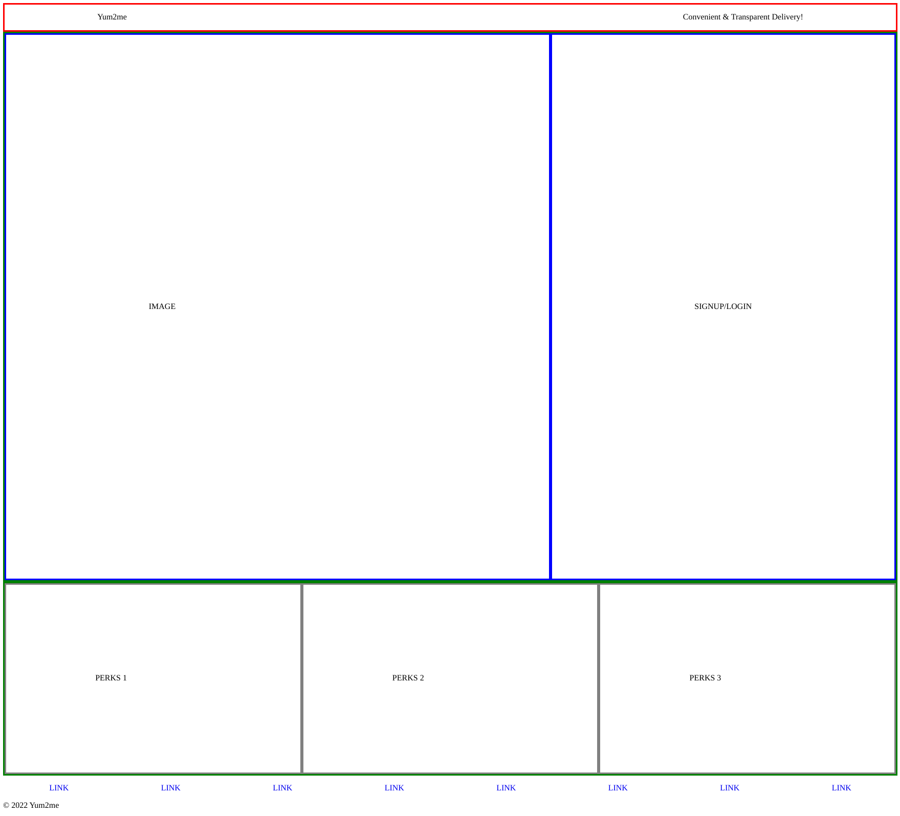
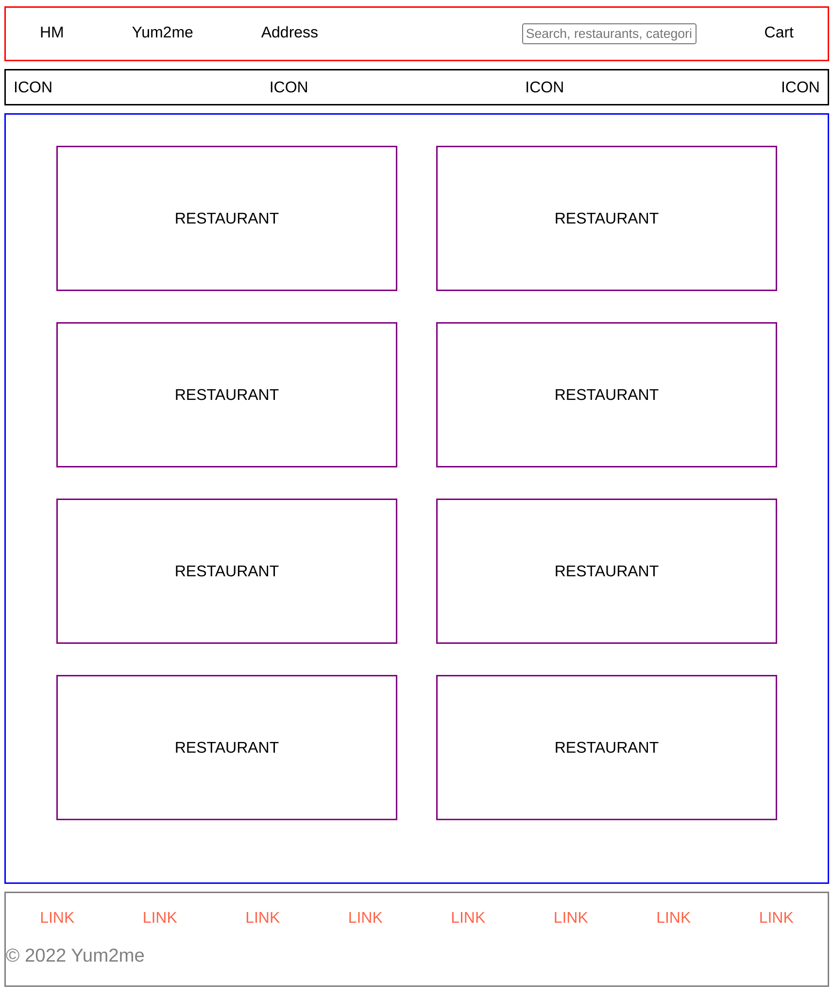
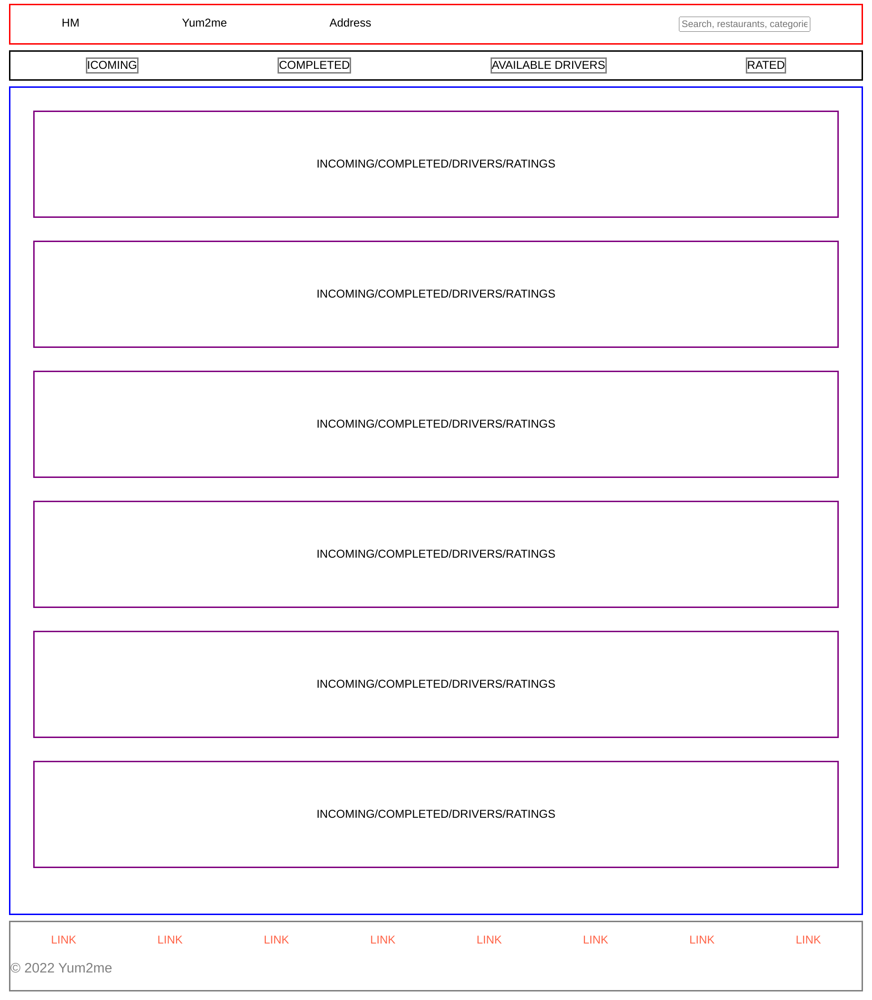
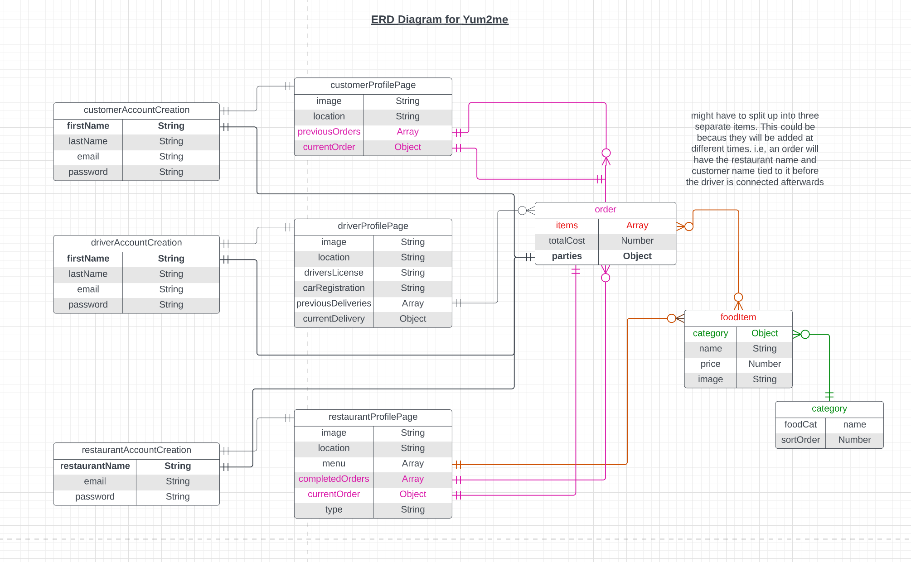
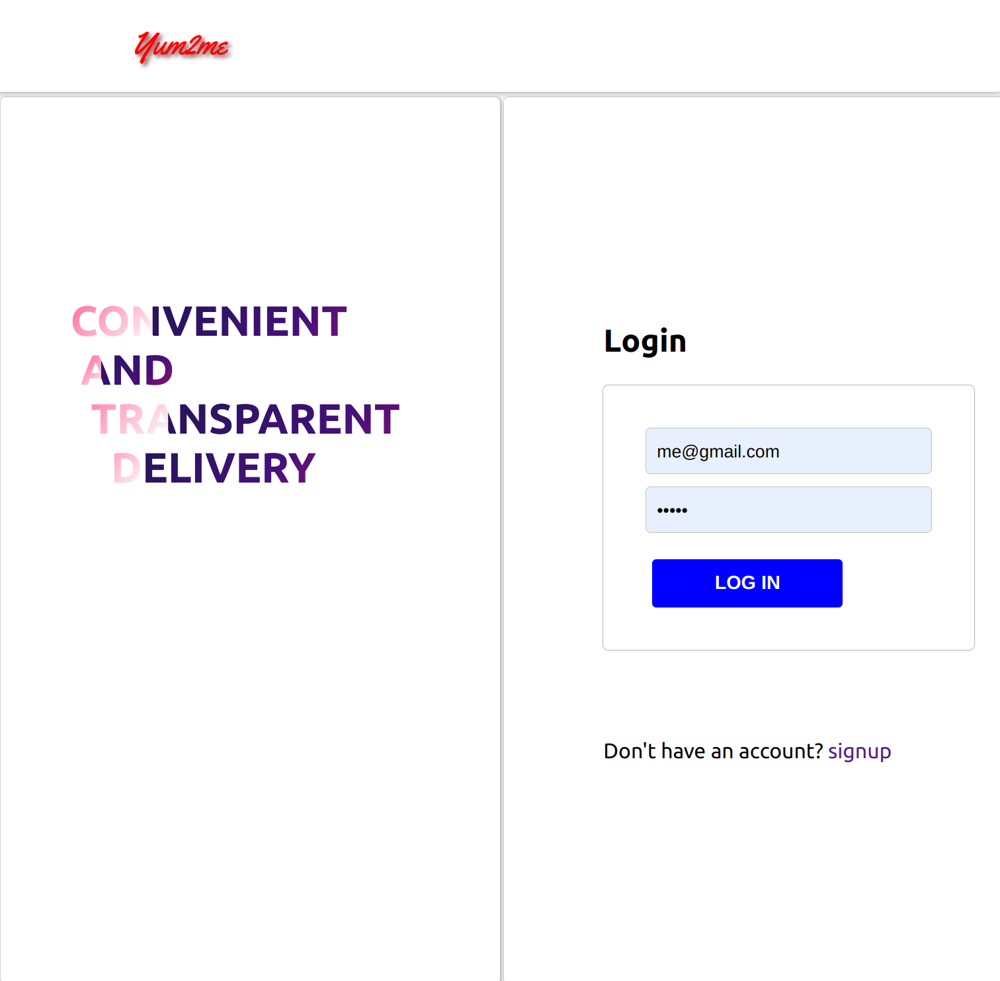
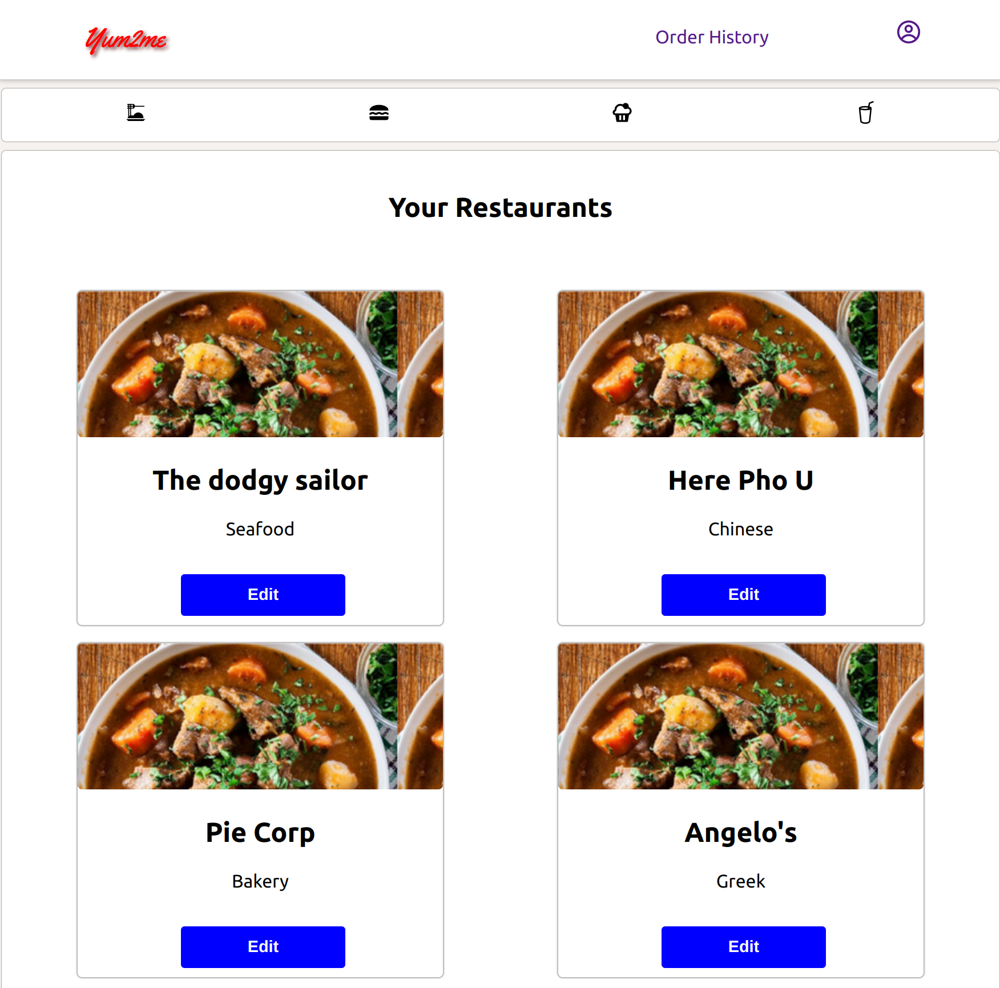
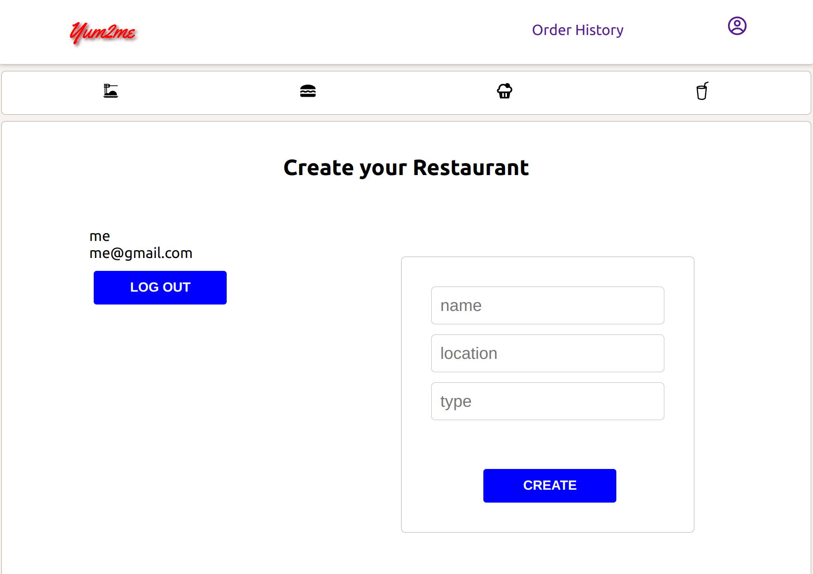
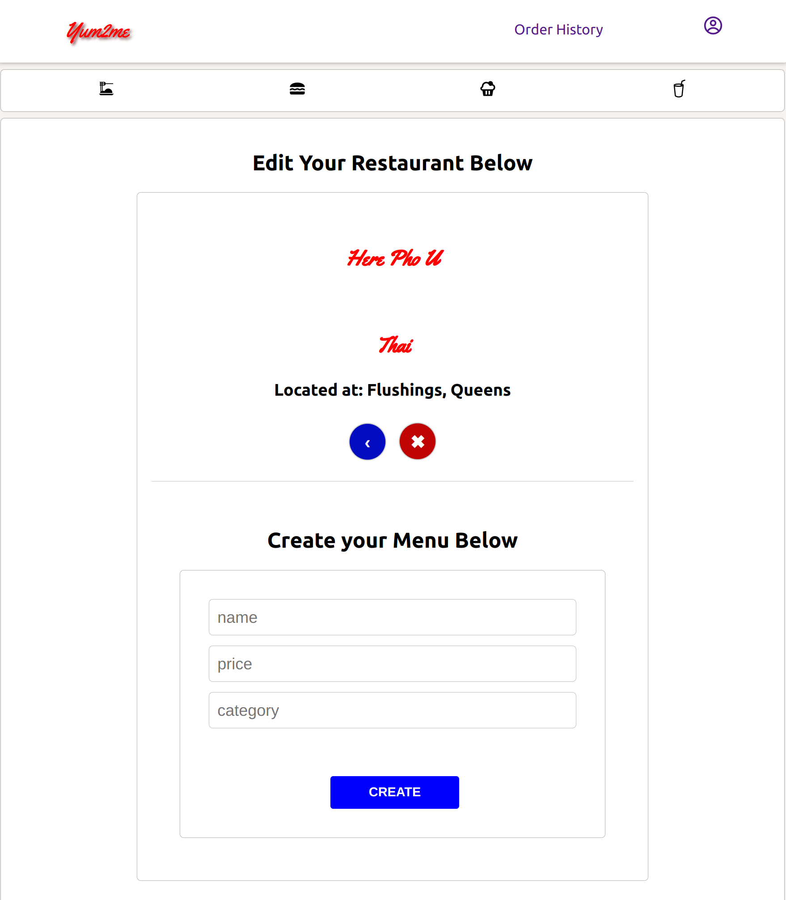
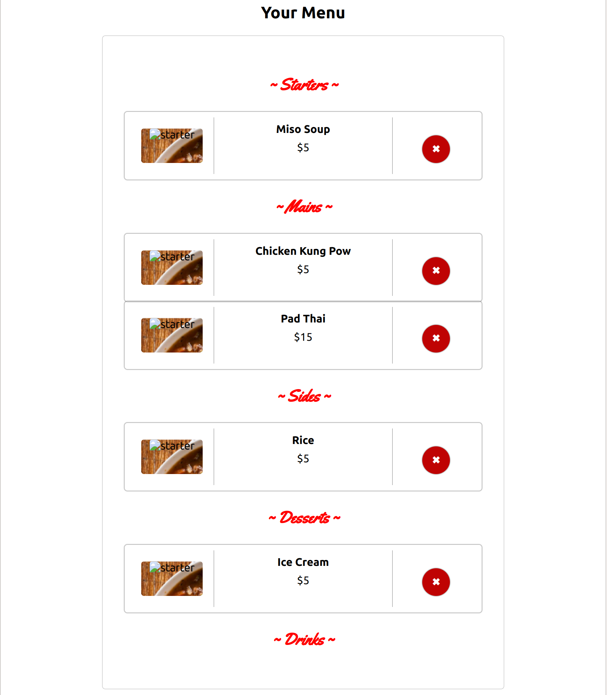

# Introduction 
Inspired by other food delivery applications drivers & restaurants lack of accountability, **Yum2Me** is a single page application that makes it easy for the Customer, Driver and Restaurant to provide feedback based on the service. It uses a unique rating system making transparency guaranteed across the board!

# Technologies Used 
* JavaScript
* CSS
* React 
* Mongoose
* Node
* Express

# Getting Started
Follow the link to the live page [here](https://starfish-app-glmra.ondigitalocean.app)

When you arrive at the landing page, there will be an option to Login or Signup. Here, you can choose whether you are accessing the Restaurant or Customer home page.

When logged in, a hamburger will direct you to the profile section. Update the information in the field provided. 

## Customers
When you select the **Yum2me** icon on the left corner of the navigation bar, you will be rediected to the index page. All registered restaurants will be listed here for the customer to select.

After selecting a restaurant to order from, you will be directed to the new orders page.

### Current Order
The restaurant profile will have a list of menu items to choose from. Once selected, it will appear in the `your order` section below the restaurant menu. Additionally, the cart icon on the rop right corner will redirect to a cart view page where you can purchase you can complete your order.


### Order History
After a purchase, you will be redirected to the orders history page where all your orders will be listed.

## Restaurants
The **Yum2me** icon will redirect you to the restaurants you have created. To edit, click on a restaurant.

This page will have the options to add, delete and edit menu items. You will also have the option of editing the original restauarant information.


# Planning
[Trello Board](https://trello.com/b/3ZxB27rA/yum2me)

[ERD Link](https://lucid.app/lucidchart/b52bc4f5-208f-4236-b238-51611daf5680/edit?beaconFlowId=6727BA894B6096A9&invitationId=inv_2e64d5cd-5c18-424b-9689-7f77493518d0&page=0_0#)

## Wire frames

### Landing Page


### Customer Facing Webpage


### Restaurant Facing Index


## ERD



## Screenshots
## Landing Page


## Home Page


## Profile


## Edit/Show Page



# Breakdown of Application

Using MERN stack setup, the application has full CRUD capability. The front end is organized into `components` and `pages` to allow for better functional component development.


## Models
Separate models for the customer and the restaurant were created. For the customer, `orders` and `customerProfile` make up all the data required. 

A user model is created for each visitor to the site that is not admin.

```js
const userSchema = new Schema({
  name: { type: String, required: true },
  email: {
    type: String,
    unique: true,
    trim: true,
    lowercase: true,
    required: true
  },
  password: {
    type: String,
    trim: true,
    minlength: 3,
    required: true
  },
  userType: { type: Boolean, required: true, default: false }
}, {
  timestamps: true,
  toJSON: {
    transform: function (doc, ret) {
      delete ret.password
      return ret
    }
  }
})
```
The `transform` method will will delete the password stored temporarily.

To complete the password security on account creation, it is hashed and salted using `bcrypt` package.

```js
userSchema.pre('save', async function (next) {
  if (!this.isModified('password')) return next()
  this.password = await bcrypt.hash(this.password, SALT_ROUNDS)
  return next()
})
```


The `orders` model uses `.virtual()` method to temporarily store the current order before its completed.

```js
const lineItemSchema = new Schema({
  qty: { type: Number, default: 1 },
  item: itemSchema
}, {
  timestamps: true,
  toJSON: { virtuals: true }
})

lineItemSchema.virtual('extPrice').get(function () {
  return this.qty * this.item.price
})
```
The above shows a new Mongoose `Schema` for a specific line item selected by the customer. `item` takes another model and nests it into the `lineItemSchema`.

```js
const Schema = require('mongoose').Schema

const itemSchema = new Schema({
  name: { type: String, required: true },
  restaurantId: { type: String },
  image: String,
  category: { type: String },
  price: { type: Number, required: true, default: 0 }
}, {
  timestamps: true
})

module.exports = itemSchema
```

When a new item is created by a restaurant, the `restaurantId` takes in the ID of the restaurant for reference.

The restaurant model also has a `menu` array element. it uses the `Schema.Types.ObjecId` to reference the `Item` instantiation from the `itemSchema` model. 

```js
const restaurantProfileSchema = new Schema({
  name: { type: String },
  user: { type: String },
  image: { type: String },
  location: { type: String, required: true },
  type: { type: String },
  menu: [{ type: Schema.Types.ObjectId, ref: 'Item' }]
}, {
  timestamps: true
})
```

## Controllers

CRUD functionality is achieved using `.create()` `.find()` `.findByIdAndUpdate()` `.findById` and `.findByIdAndDelete` Mongoose methods.

To note, the `createMenu` function will take the body of the new menu item created, then finds the restuarant by `restaurantId` passed in from the front end, then pushes the object Id of the menu item into the `menu` array element defined in the model (see models)


```js
  async createMenu (req, res, next) {
    try {
      const newMenuItem = await Item.create(req.body)
      await Restaurant.findByIdAndUpdate(newMenuItem.restaurantId, {
        $push: {
          menu: newMenuItem._id
        }
      })
      res.status(200).json(newMenuItem)
    } catch (error) {
      console.log(error)
    }
  }
```

The front end function for performing the `POST` request is below

```js
  const createMenuItem = async (category) => {
    try {
      const response = await fetch('/api/restaurants/menu', {
        method: 'POST',
        headers: {
          'Content-Type': 'application/json'
        },
        body: JSON.stringify({ ...newMenuItem })
      })
      const data = await response.json()
      setNewMenuItem({
        name: '',
        restaurantId: foundRestaurant._id,
        category,
        price: Number
      })
    } catch (error) {
      console.error(error)
    }
  }
```

The `setMenuItem` useState hook will take the current restaurant selected by its ID and store it in `restaurantId` element in the the `Item` model. This will nest the ID into the new item before it gets posted to the backend through Mongoose.


## Components
Reusable functional components are organized and stored in the `src` folder for use in `pages`. The file structure for the components folder is shown below.

```
components                      
├─ Buttons                      
│  ├─ BackButton                
│  └─ DeleteRetaurantButton.js  
├─ Comments                     
│  └─ Comments.js               
├─ Footer                       
│  └─ Footer.js                 
├─ LineItem                     
│  └─ LineItem.js               
├─ LoginForm                    
│  └─ LoginForm.js              
├─ LoginLinks                   
│  ├─ LoginLinks.js             
│  └─ LoginLinks.module.scss    
├─ MenuItems                    
│  ├─ MenuItem.js               
│  └─ NewMenuItem.js            
├─ NavBar                       
│  ├─ NavBar.js                 
│  └─ NavBar.scss               
├─ NavBarLinks                  
│  ├─ NavBar.module.scss        
│  └─ NavBarLinks.js            
├─ OrderDetail                  
│  └─ OrderDetail.js            
├─ Perks                        
│  └─ Perks.js                  
├─ Restaurant                   
│  ├─ AllRestaurants.js         
│  └─ ShowRestaurant.js         
├─ SignUpForm                   
│  └─ SignUpForm.js             
├─ UserLogOut                   
│  └─ UserLogOut.js             
└─ UserProfileForm              
   ├─ CustomerProfileForm.js    
   └─ RestaurantProfileForm.js  
```

Props drilling was made easier by follwing this structure. In some cases, nearly 20 props from a parent component or page has to be drilled!

One of the components that stands is for mapping out the menu items on creation the `RestaurantEditPage`. 

```js
  return (
    <>
      {
        menuItems.length > 0
          ? <>
            {
              menuItems.filter(item => item.category === filterOne || item.category === filterTwo).map((item) => {
                return (
                  <>
                    <div className='res-icon' id='menu-item' key={item._id}>
                      <div className='menu-image'>
                        
                      </div>
                      <div className='menu-details'>
                        <h4>{item.name}</h4>
                        <p>${item.price}</p>
                      </div>

                      {
                      user.userType
                        ? <div className='menu-button'>
                          <button onClick={() => {
                            handleRemoveItem(item._id)
                          }}
                          >&#10006;
                          </button>
                        </div>
                        : <div className='menu-button'>
                          <button onClick={() => {
                            handleAddToOrder(item._id)
                            }}>&#43;
                          </button>
                        </div>
                    }

                    </div>
                  </>
                )
              })
            }
          </>
          : 'No items to display'
      }
    </>
  )
```

I takes in `filterOne` and `filterTwo` parameters from the `RestaurantEditPage` to filter by starters, mains, sides, desserts and drinks. This is then mapped out onto the page where the component is required (see screenshots).

## Pages
Pages for the application will take in the components mentioned above. Currently, the file structure for the `pages` folder is stored in `src`. See file tree below.

```
pages                               
├─ App                              
│  ├─ App.js                        
│  └─ App.module.scss               
├─ EditPages                        
│  └─ RestaurantEditPage.js         
├─ HomePage                         
│  └─ HomePage.js                   
├─ LandingPage                      
│  └─ LandingPage.js                
├─ LoginPage                        
│  ├─ LoginPage.js                  
│  └─ LoginPage.module.scss         
├─ NewOrderPage                     
│  ├─ NewOrderPage.js               
│  └─ NewOrderPage.module.scss      
├─ OrderHistoryPage                 
│  ├─ OrderHistoryPage.js           
│  └─ OrderHistoryPage.module.scss  
├─ ProfilePages                     
│  ├─ CustomerProfile.js            
│  └─ RestaurantProfile.js          
├─ RestaurantByUser                 
│  └─ RestaurantByUser.js           
└─ SignupPage                       
   ├─ SignupPage.js                 
   └─ SignupPage.module.scss  
```
The `RestaurantEditPage` contains three different components, `RestuarantShowPage`, `NewMenuItem` and `MenuItem`. They allow the user to edit the original restuarant profile, add new menu items, delete menu items and delete the whole restaurant profile. Similarly, the `NewOrderPage` resuses `RestuarantShowPage` and `MenuItem` components without the same options provided in the `RestuarantEditPage`.


# Unsolved Problems 
* A customer can order from more than one restaurant at a time
* Landing page styling needs update
* Correct routing on signup

# Future Icebox
* Ternary to ensure a user can't order from more than one restaurant at a time
* DRY components and pages
* Multi user chat system
* Search bar 
* Utilize SCSS instead of CSS


      
